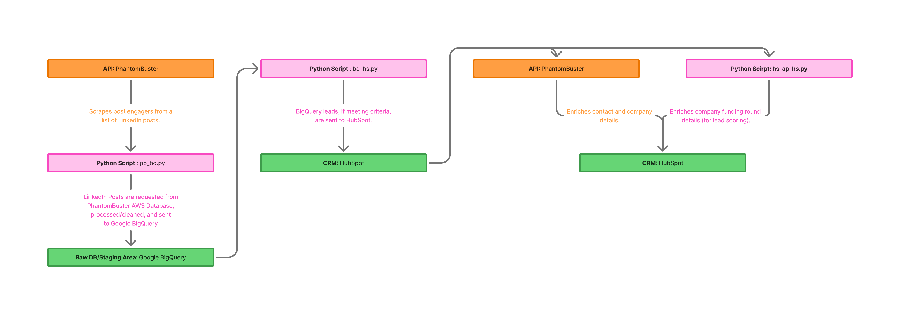
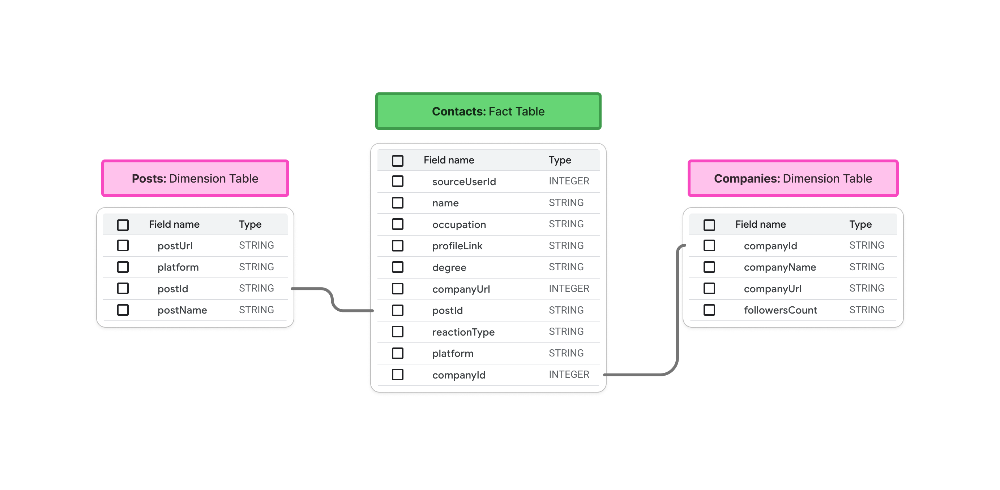

# LinkedIn to HubSpot Lead Generation Pipeline

## 🚀 Overview
This project is a **fully automated and scheduled data pipeline** that scrapes LinkedIn post engagers, formats the data into a relational format, stores it in **BigQuery**, and pushes qualified leads into **HubSpot** for outreach. The pipeline has been modularized into separate Python scripts for better maintainability and scalability.

## 📊 Pipeline Architecture

- **Phantombuster API** → Scrapes LinkedIn post engagers.
- **Python Script: pb_bq.py** → Pulls and preprocesses PhantomBuster data into realtional DB, sends to BigQuery.
- **Google BigQuery** → Stores and processes raw lead data
- **Python Script: bq_hs.py** →Pulls BigQuery leads, formats them, and pushes the newest leads to Hubspo.
- **HubSpot API** → Pushes formatted lead data for sales outreach.
- **Sales Team** → Engages with leads and updates stages manually.

## 🛠️ Technologies Used
- **Python**
- **Phantombuster API**
- **Google BigQuery**
- **HubSpot API**
- **Numpy**
- **Pandas**
- **Requests**
- **Gspread**

## 📊 BigQuery Schema


## 📂 Project Structure
```
📁 organic_social_pipelins
│── 📁 scripts/ 
│    ├── funcs.py                  # Helper functions for the ETL python scripts below
│    ├── pb_bq.py                  # Pulls/formats data from PhantomBuster; sends data to BigQuery
│    ├── bq_hs.py                  # Formats BigQuery data; sends data to HubSpot
│
│── 📁 config/                     # Configs and API keys (excluded from Git); Soon to be sunsetted.
│    ├── apollo_key.txt
│    ├── hs_key.txt
│    ├── pb_link.txt
│    ├── phantombuster_key
│    ├── sheets_key.json
│    ├── bigquery.json
│
│
│── 📁 docs/                       # Documentation providing examples of runs
│    ├── pb_bq_example_output.txt  # Example output: PhantomBuster -> BigQuery Pipeline
│    ├── bq_hs_example_output.txt  # Example Output: BigQuery -> Hubspot Pipeline
│
│── 📁 media/                      # Contains media (images and flowcharts for github_repo)
│    ├── ...
│
│─ .gitignore                       
│─ requirements.txt              
```

## ⚡ Quickstart
### **1️⃣ Install Dependencies**
```bash
pip install -r requirements.txt
```

### **2️⃣ Set Up API Keys**
Ensure that all required API keys are present in the `.env/` file.

### **3️⃣ Run the Full Pipeline**
```bash
python scripts/pb_bq.py
python scripts/bq_hs.py
```
